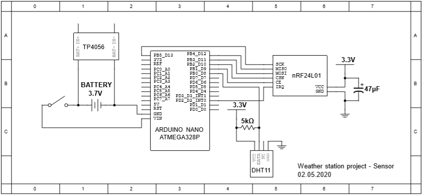

# Weather Station
We made this project as for part of our education at AGH UST. The main idea is make simple weather station on Atmega328 in C. Our application include stationary device which can measure humidity and temperature using DHT11 sensor. 16x2 display and real time clock are included too. You can switch displayed data with buttons. Station is connected with outdoor sensor with nRF24L01 radio module. All of our code was written by us based on documentations and public forums so it works best with similar applications (ex. connecting 2 devices for sending data). The weather station sends request for new measurments with specified period - feel free to change it. If devices lost connection and station will wait for data, sensor will interrupt itself after specified time and try to resend data.  

# Hardware requirements
- Arduino NANO for sensor
    - We supplied it with 3.7V battery but you can use any else (compatible with Arduino NANO)
    - nRF24L01 **HAVE TO** be connected to 3.3V with VCC
    - 47uF electrolytic capacitor parallel to GND and 3.3V
    - DHT11 sensor
    - 5k pull-up resistor for DHT11
    - Switch
    - Charging module (optional)
- Arduino UNO for station
    - Will see
## Sensor
Sensor include 2 libraries: DHT11 and rf24. First is just for reading DHT11 data and contain only one function. To read this data you should put into function 4 elements array. Function will overwrite elements. rf24.h include many functions but for simple use you'll need only read, get_status and init. Don't forget - in init function you **must** have the same channel and payload for transceiver and receiver. In other way, you'll be not able to send data between devices.   
  
In our example, for TX mode all interrupts are masked. But you still can check if it occurs in get_status(). For RX mode only RX interrupt is enabled.
### Connections scheme 

### Sensor procedure

